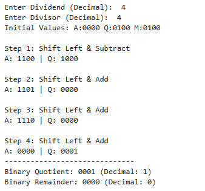

# Lab 10: Program to Implement the Non-Restoring Division Algorithm

## Objective
- To understand the **non-restoring division algorithm** for unsigned binary numbers.  
- To implement the algorithm in Python and verify with test cases.  

## Theory
The **Non-Restoring Division Algorithm** is a binary division method that avoids the costly restoration step found in the restoring algorithm.  
It works with a **partial remainder (A)** and divisor (M) over *n* steps.  

- In **restoring division**, if a subtraction yields a negative partial remainder, the dividend is restored by adding back the divisor.  
- In **non-restoring division**, the restoration step is skipped. Instead, the algorithm remembers the sign of `A` and uses it to decide the next operation.  

This makes the algorithm more efficient while still producing correct quotient and remainder values.

## Algorithm Steps
Given dividend **Q** (*n* bits) and divisor **M** (*n* bits), both unsigned:

1. **Initialize**  
   - `A = 0`  
   - Load `Q` into the quotient register  

2. **For each of n steps**:  
   a. Left-shift `[A, Q]` by 1 bit.  
   b. If `A ≥ 0`: subtract `M` from `A` → `A = A − M`.  
      If `A < 0`: add `M` to `A` → `A = A + M`.  
   c. If `A ≥ 0`: set `Q0 = 1` (quotient bit = 1).  
      If `A < 0`: set `Q0 = 0` (quotient bit = 0).  

3. **Final correction**  
   - After *n* steps, if `A < 0`, restore by adding `M`.  

4. **Result**  
   - `Q` holds the quotient.  
   - `A` holds the remainder.  

## Output
Simulation waveform of the non-restoring division algorithm:  

## Discussion
- The algorithm successfully avoided the restoration step, improving efficiency compared to restoring division.  
- The **sign of the partial remainder (A)** guided whether subtraction or addition was performed in each cycle.  
- The final correction ensured the remainder was non-negative.  
- Test cases confirmed correctness by comparing results with standard division.  

## Conclusion
This lab demonstrated the implementation of the **non-restoring division algorithm** in Python.  
Key learnings:  
- The algorithm efficiently divides unsigned binary numbers without repeated restoration.  
- Quotient and remainder are obtained after *n* cycles with a final correction step.  
- Simulation results matched expected outputs, validating the algorithm.  

The non-restoring division algorithm is an important technique in **computer arithmetic**, forming the basis of division units in digital processors.  
