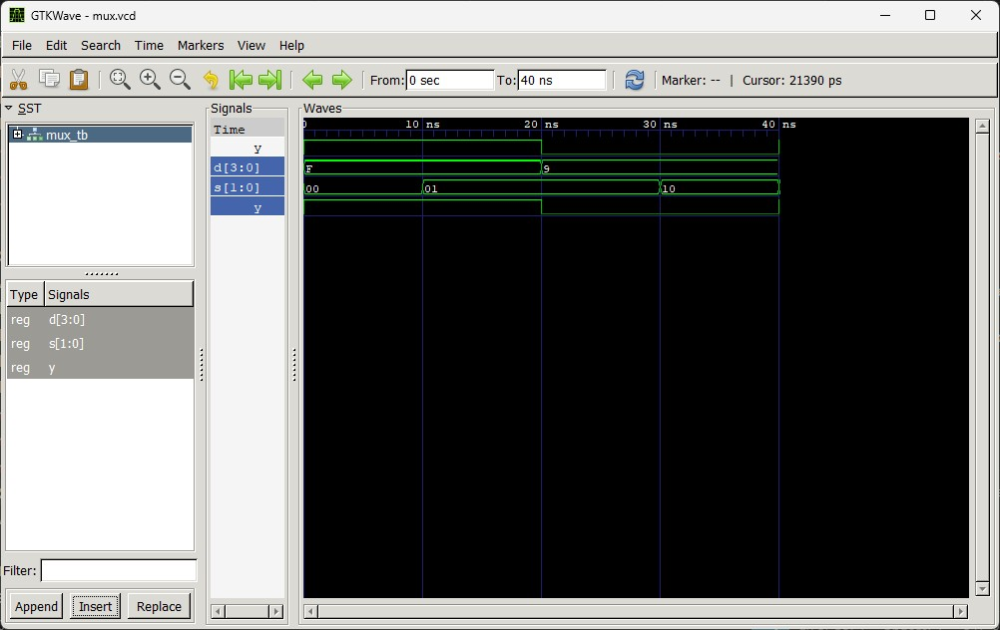
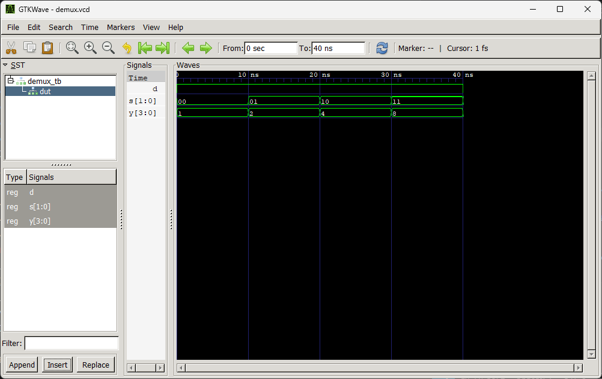

# Lab 4: VHDL Code for Combinational Circuits (MUX and DEMUX)

## Objective
- To design and simulate a 4-to-1 Multiplexer (MUX) in VHDL.  
- To design and simulate a 1-to-4 Demultiplexer (DEMUX) in VHDL.

---

## Theory

### Multiplexer (MUX)
A multiplexer selects one of \(2^n\) input data lines and routes it to a single output based on *n* select lines.  
A **4-to-1 MUX** has 4 data inputs (D0–D3), 2 select lines (S1, S0), and 1 output (Y).

| S1 | S0 | Y   |
|----|----|-----|
| 0  | 0  | D0  |
| 0  | 1  | D1  |
| 1  | 0  | D2  |
| 1  | 1  | D3  |

---

### Demultiplexer (DEMUX)
A demultiplexer routes a single input to one of \(2^n\) output lines based on *n* select lines.  
A **1-to-4 DEMUX** has 1 data input (D), 2 select lines (S1, S0), and 4 outputs (Y0–Y3).

| S1 | S0 | Active Output |
|----|----|---------------|
| 0  | 0  | Y0 = D        |
| 0  | 1  | Y1 = D        |
| 1  | 0  | Y2 = D        |
| 1  | 1  | Y3 = D        |

---

## Output
**MUX OUTPUT**

**DEMUX OUTPUT**

---

## Discussion and Conclusion
- The **MUX** successfully selects one of four inputs based on the 2-bit select lines and routes it to the single output.  
- The **DEMUX** correctly distributes the single input to one of four outputs depending on the select lines.  
- Simulation results confirm the expected truth tables for both circuits.  
- This lab demonstrates the fundamental difference between **data selection (MUX)** and **data distribution (DEMUX)** in combinational circuit design.
