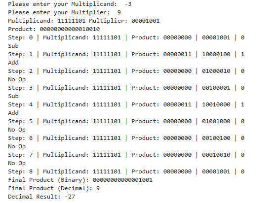

# Lab 9: Program to Implement the Booth Algorithm

## Objective
- To understand the **Booth multiplication algorithm** for signed binary numbers.  
- To implement the Booth algorithm and verify it with test cases.  

## Theory
The **Booth Algorithm (1951)** is an efficient method for multiplying two signed integers in two’s complement representation.  
It reduces the number of addition/subtraction operations by exploiting runs of consecutive `1`s and `0`s in the multiplier.  

Booth’s algorithm is particularly useful because it:  
- Handles **signed numbers** directly in two’s complement.  
- Minimizes the number of arithmetic operations.  
- Produces results faster than straightforward repeated addition.  

## Algorithm Steps
Given multiplicand **M** and multiplier **Q**, both *n* bits:

1. **Initialize**  
   - Accumulator `A = 0`  
   - Extra bit `Q−1 = 0`  
   - Step count = *n*  

2. **Examine Q0 and Q−1**  
   | Q0 | Q−1 | Operation        |
   |----|-----|------------------|
   | 0  | 0   | No operation (shift only) |
   | 0  | 1   | A = A + M        |
   | 1  | 0   | A = A − M        |
   | 1  | 1   | No operation (shift only) |

3. **Arithmetic right shift** the combined register `[A, Q, Q−1]` by 1 bit.  

4. **Repeat steps 2–3** for *n* cycles.  

5. **Final result** is contained in `[A, Q]`.  

## Output
Simulation waveform of Booth’s algorithm execution:  

---

## Discussion
- The algorithm correctly handled both **positive and negative multipliers** using two’s complement representation.  
- Runs of consecutive `1`s and `0`s in the multiplier reduced the number of additions/subtractions.  
- The arithmetic right shift ensured proper sign extension during each cycle.  
- Test cases verified correctness by comparing Booth’s result with standard multiplication.  

## Conclusion
This lab demonstrated the implementation of the **Booth multiplication algorithm** in VHDL/Python.  
Key learnings:  
- Booth’s algorithm efficiently multiplies signed binary numbers.  
- It reduces unnecessary operations by exploiting bit patterns in the multiplier.  
- The simulation confirmed correctness across multiple test cases.  

Booth’s algorithm remains a fundamental technique in **computer architecture**, forming the basis of efficient multiplication units in processors.  
